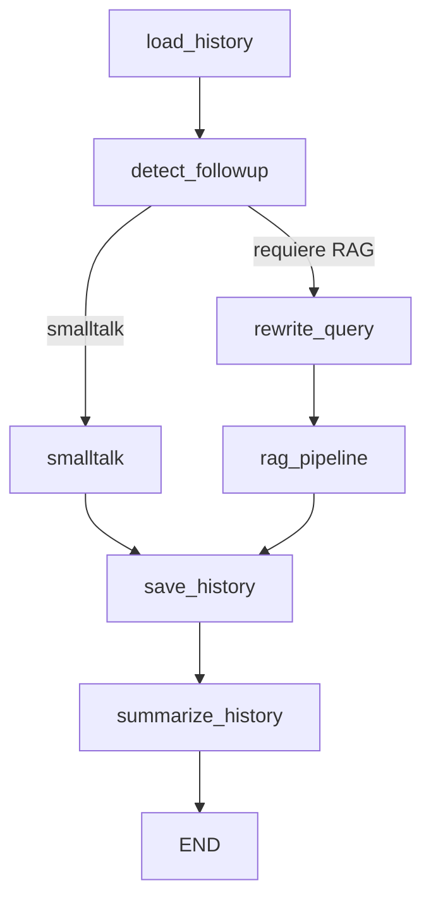

# RAG Chatbot API

Asistente conversacional con memoria y recuperación aumentada (RAG), construido con **FastAPI**, **LangGraph**, **LLM**, **vectorstore** y persistencia en **SQLite**.  

Esta API expone un chatbot que:

- Responde preguntas usando un modelo de lenguaje (LLM) + documentos indexados  
- Mantiene memoria de conversación persistente por `session_id`  
- Detecta si el turno es follow-up (ej: “Me podrías decir más?”) y reescribe la pregunta  
- Detecta smalltalk y responde sin buscar en la base de conocimiento  
- Resume el historial automáticamente cuando crece demasiado  
- Devuelve citas o fuentes del contexto recuperado  
- Se ejecuta localmente o con Docker

---

## Cómo funciona el chatbot?

La lógica principal se basa en un **grafo de estados** (LangGraph) que orquesta cada paso de la conversación.

### Flujo de procesamiento

Usuario → load_history → detect_followup → (smalltalk | rewrite_query)
→ rag_pipeline → save_history → summarize_history → Respuesta

### Explicación resumida de los nodos

| Nodo | Función |
|------|---------|
| `load_history` | Carga historial reciente y resumen desde SQLite |
| `detect_followup` | Decide si la pregunta depende del historial o es smalltalk |
| `smalltalk` | Responde sin RAG si es saludo, conversación ligera, etc. |
| `rewrite_query` | Reescribe la pregunta si es follow-up (para dar contexto al RAG) |
| `rag_pipeline` | Recupera documentos relevantes + construye prompt + responde |
| `save_history` | Guarda pregunta + respuesta + metadatos para trazabilidad |
| `summarize_history` | Resume conversaciones largas para mantener límite de tokens |

### Diagrama del grafo




### Instalación

#### Inicialización obligatoria antes de usar la API

Antes de levantar el servidor o probar los endpoints, es necesario preparar los datos del sistema RAG.
Esto se hace una sola vez (a menos que cambie el PDF o quieras regenerar el vectorstore).

Debés ejecutar estos dos scripts en este orden:
```
python api/scripts/preprocess.py
python api/scripts/build_vectorstore.py
```

- preprocess.py toma el PDF de origen, extrae el texto y lo divide en chunks.
- build_vectorstore.py convierte esos chunks en embeddings y construye el índice FAISS usado por el chatbot.

#### 1) Ejecución local (sin Docker)
```
git clone <repo>
cd <repo>
pip install -r requirements.txt
uvicorn api.app.server:app --reload --host 0.0.0.0 --port 8000
```
#### 2) Ejecución con Docker Compose (recomendada)
```
docker compose up --build
```

Esto abrirá la API en:

```
http://localhost:8000
```

### Uso de la API
#### POST /chat
Envía una pregunta con un session_id y recibe respuesta con fuentes y metadatos.

Request
```
POST /chat
Content-Type: application/json
{
  "session_id": "user-123",
  "question": "¿Qué es el modelo de RLS y cuál es su ecuación general?"
}
```

Response
```
{
  "question_rewritten": "¿Qué es el modelo de regresión lineal simple y cuál es su ecuación general?",
  "answer": "El modelo de regresión lineal simple es un método estadístico que se utiliza para predecir una variable de respuesta cuantitativa ...",
  "followup": false,
  "skip_rag": false,
  "sources": [
      {
        "id": "page_80_chunk_1",
        "page": 80,
        "chapter": "3 Linear Regression",
        "section": "3.1 Simple Linear Regression",
        "subsection": "3.1.1 Estimating the Coefficients"
      },
      {
        "id": "page_79_chunk_1",
        "page": 79,
        "chapter": "3 Linear Regression",
        "section": "3.1 Simple Linear Regression"
      }
    ],
  "history_used": false
}
```


### Persistencia de historial
La app usa una base SQLite que una vez creada se ubicará automáticamente en:

```
db/chat_history.sqlite
```

Se almacenan:
| Tabla              | Contenido                                        |
| ------------------ | ------------------------------------------------ |
| `chat_history`     | Mensajes usuario/assistant con orden y timestamp |
| `session_summary`  | Resumen comprimido del historial                 |
| `rag_answers_meta` | Fuentes y contexto usado por el pipeline RAG     |
| `rag_evals`        | Evaluaciones automáticas tipo RAGAS              |

### Arquitectura del Sistema

El siguiente diagrama muestra la arquitectura completa del proyecto:

